# Identity Lifecycle Automation (Joiner–Mover–Leaver)

> Automating employee identity events in **Microsoft Entra ID** using **Python** and the **Microsoft Graph API** — eliminating manual access provisioning and enforcing least-privilege RBAC across the full employee lifecycle.

## Overview

In enterprise IAM, the Joiner-Mover-Leaver (JML) lifecycle is how organizations manage identity risk across the employee lifecycle. This project automates all three events against a live Microsoft Entra ID tenant using the Microsoft Graph API.

| Event | Trigger | Actions Taken |
|-------|---------|---------------|
| **Joiner** | status = new | Creates Entra ID account, assigns department groups, forces password reset |
| **Mover** | status = moved | Computes group delta, revokes old access, grants new access, updates job attributes |
| **Leaver** | status = left | Disables account, revokes all active sessions, strips all group memberships |

## Architecture

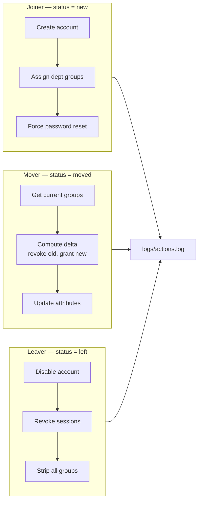

## Tech Stack

## Tech Stack

| Component | Purpose |
|-----------|---------|
| Python 3.11+ | Core automation engine |
| MSAL | OAuth 2.0 client credentials flow |
| Microsoft Graph API v1.0 | All Entra ID operations |
| Microsoft Entra ID | Target identity directory |
| python-dotenv | Secure credential loading |
| pytest + unittest.mock | Unit tests with mocked Graph API |

## Lab Environment

Gates Cyber Consulting Entra ID tenant (Microsoft 365 Developer Program).

### Step 1 — Baseline users documented
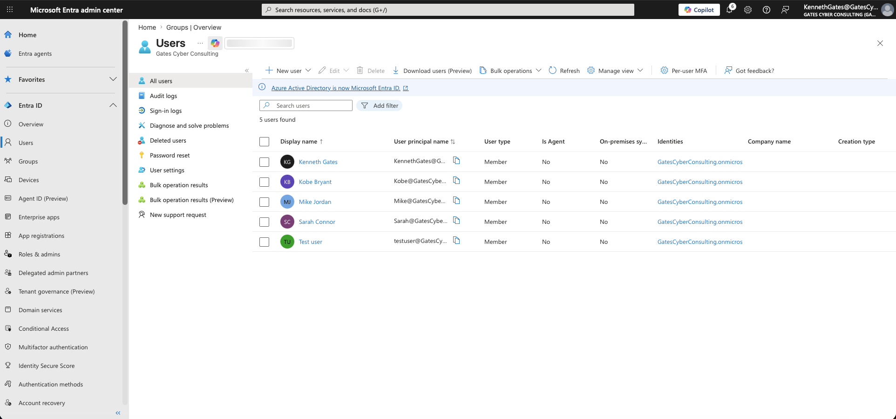

### Step 2 — Security groups created
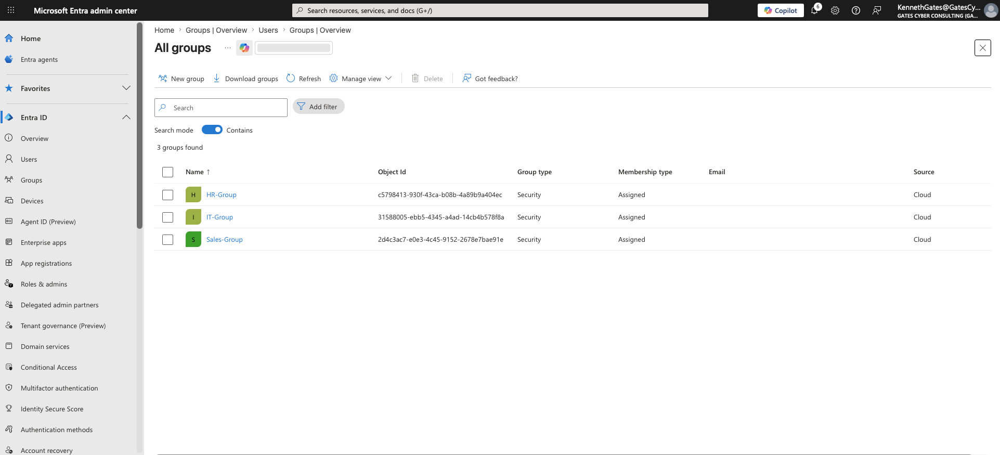

| Group | Object ID |
|-------|-----------|
| HR-Group | c5798413-930f-43ca-b08b-4a89b9a404ec |
| IT-Group | 31588005-ebb5-4345-a4ad-14cb4b578f8a |
| Sales-Group | 2d4c3ac7-e0e3-4c45-9152-2678e7bae91e |

### Step 3 — User department attribute confirmed
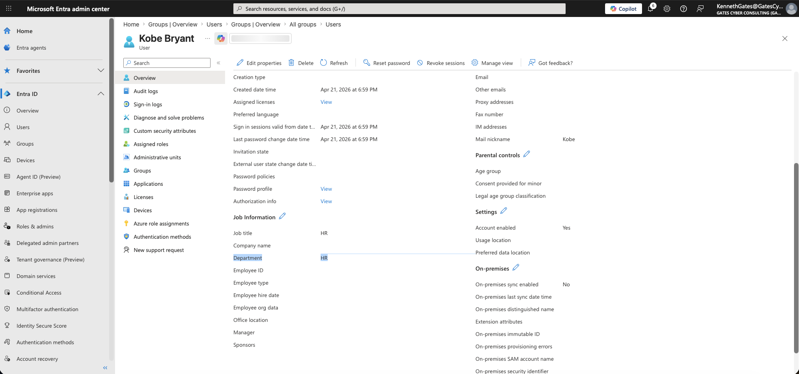

### Step 4 — Baseline group membership confirmed
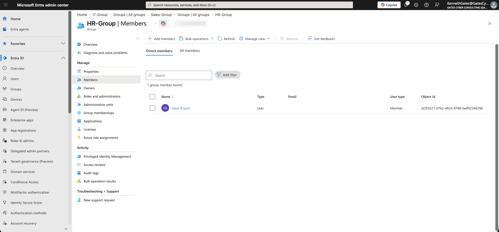

### Step 5 — App registration created
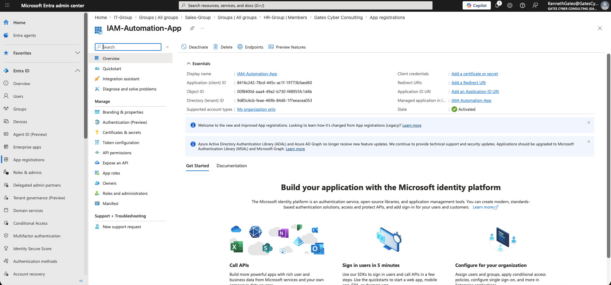

### Step 6 — Client secret created
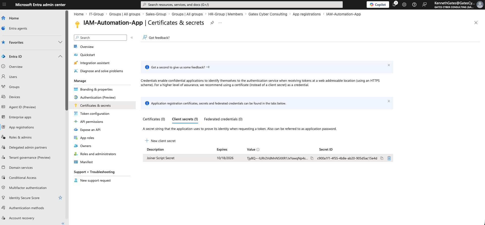

### Step 7 — API permissions granted
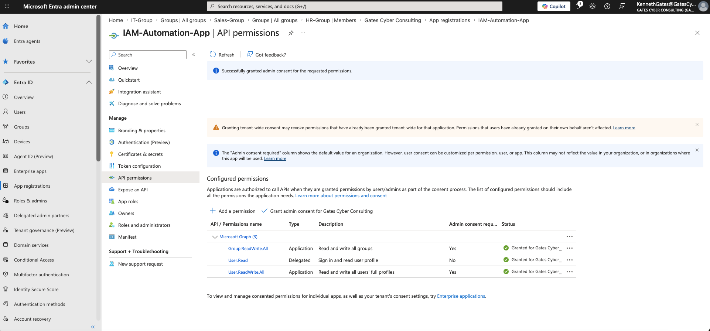

| Permission | Type | Purpose |
|------------|------|---------|
| User.ReadWrite.All | Application | Create, update, disable users |
| Group.ReadWrite.All | Application | Assign and remove group memberships |

### Step 8 — Token acquired, user created (201)
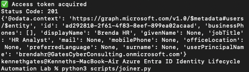

### Step 9 — Secret rotated mid-lab
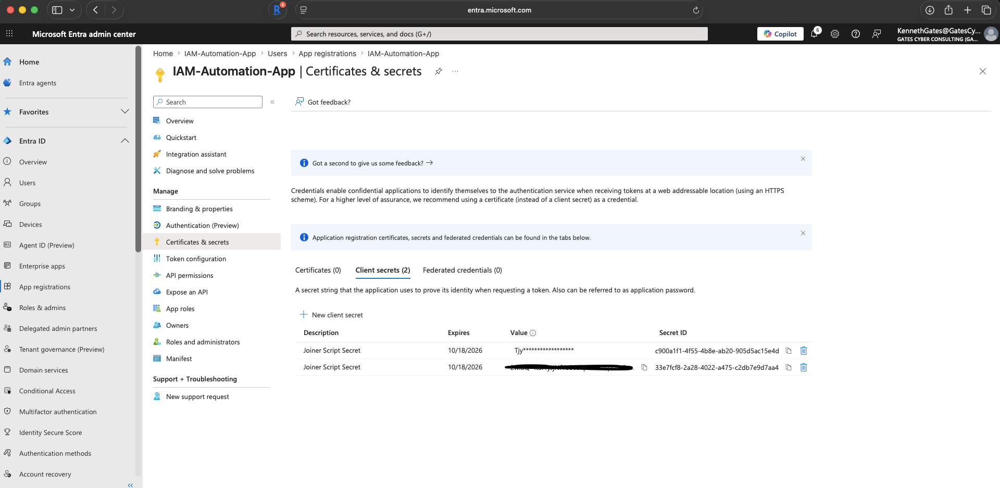

### Step 10 — Old secret removed
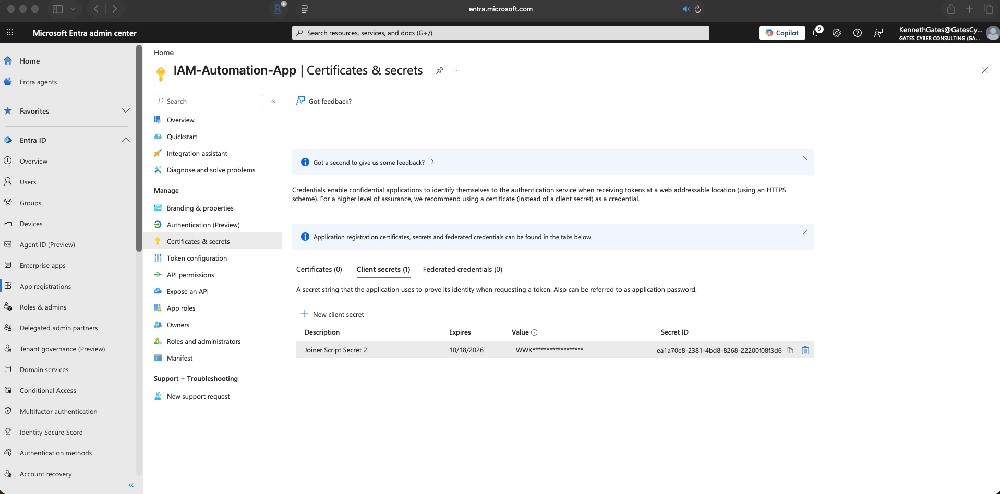

### Step 11 — Group assignment code
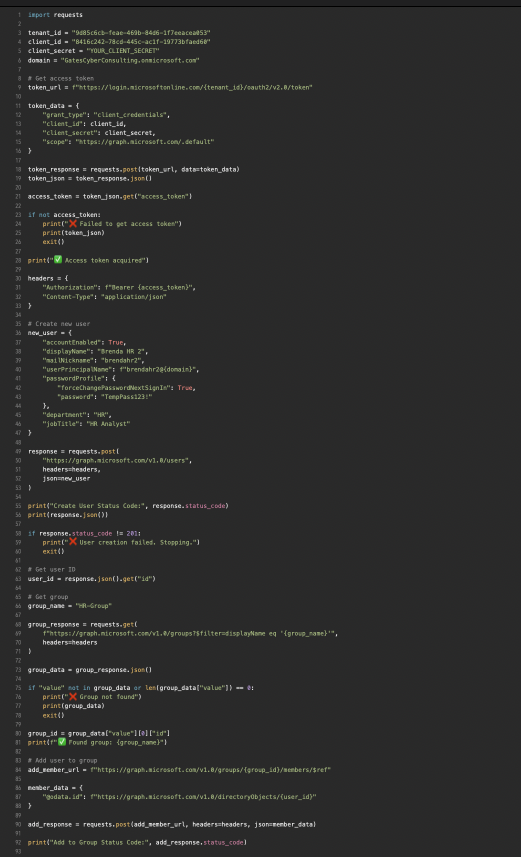

### Step 12 — Group before assignment
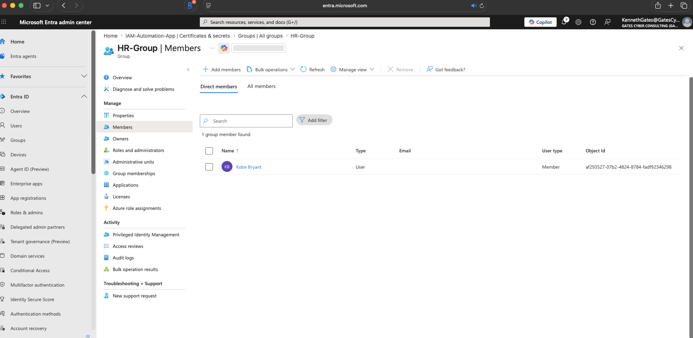

### Step 13 — Joiner script success
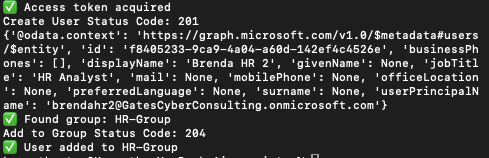

### Step 14 — User created in portal
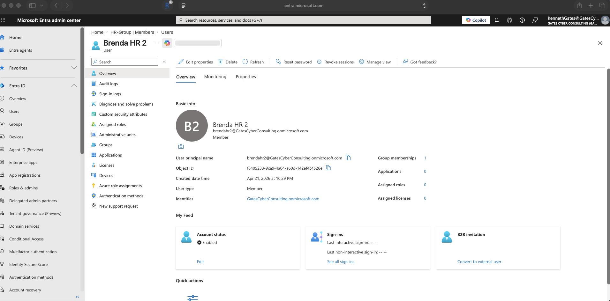

### Step 15 — Group membership updated
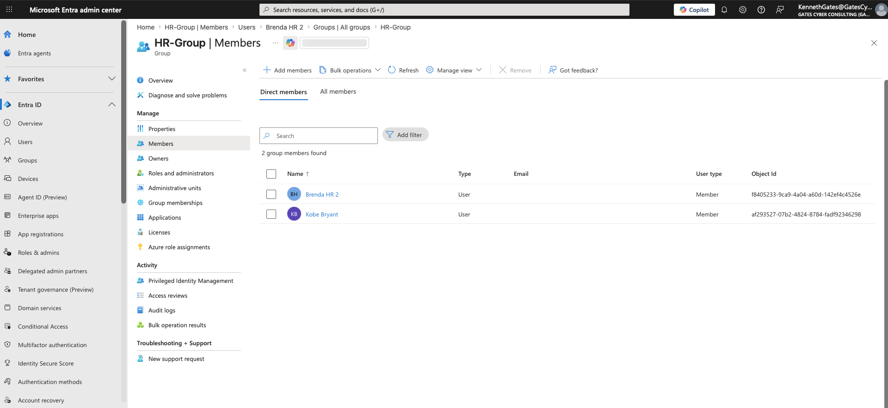

## Setup

### 1. App Registration
- Entra ID → App registrations → New registration
- API permissions: User.ReadWrite.All, Group.ReadWrite.All (Application type)
- Grant admin consent

### 2. Configure environment
```bash
cp .env.example .env
# Fill in TENANT_ID, CLIENT_ID, CLIENT_SECRET, DOMAIN
```

### 3. Install dependencies
```bash
pip install -r requirements.txt
```

### 4. Run
```bash
cd src
python jml_engine.py
```

## Running Tests
```bash
pip install pytest
pytest tests/test_jml.py -v
```

## Security Design Decisions

**Why disable then revoke then strip groups (Leaver)?**
Disabling blocks new logins. Revoking sessions kills existing tokens immediately. Group removal happens last since the account is already dead at the auth layer.

**Why set-difference logic for Mover?**
Rather than clearing all groups and reassigning, the Mover computes the exact delta — revoke what is no longer needed, grant only what the new role requires. This enforces least privilege at every role transition.

**Why is the temp password never logged?**
Audit logs are retained long term and often forwarded to SIEMs. Logging credentials is a security anti-pattern regardless of how short-lived they are.

## Stretch Goals

- [ ] Azure Logic App webhook trigger instead of manual CSV
- [ ] Conditional Access policy on new joiners requiring MFA
- [ ] KQL query in Sentinel to detect post-leaver sign-ins
- [ ] 30-day soft-delete queue before hard delete
